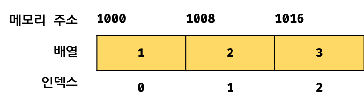
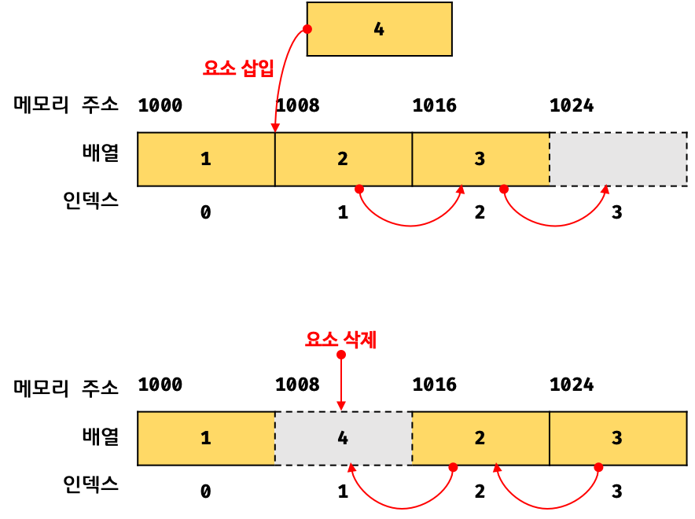

# 보통의 배열

> ## 배열(Array) 이란 일반적으로 같은 자료형의 데이터를 메모리상에 연속적으로 저장하는 자료형을 말한다.
<br/>

<center></center>

이처럼 배열은 그 메모리 주소에 맞는 인덱스 값을 갖기 때문에 단 한번의 연산으로 임의의 요소에 접근 할 수 있고 이 때의 시간복잡도는 O(1)이다.

하지만 정렬되지 않은 배열에서 특정 값을 탐색하는 경우, 모든 배열 요소를 처음부터 값을 발견할 때까지 차례대로 탐색하는 선형탐색을 진행한다면 시간복잡도는 O(n)이다.

```javascript

function linearSearch(array, target){
    const length = array.length;
    for(let i = 0; i<length; i++) {
        if(array[i] === target) return i;
    }

    return -1;
}

console.log(linearSearch([1,2,3,4,5], 3));
```

또한 배열 중간에 요소를 삽입하거나 삭제하는 경우, 배열의 연속성을 유지하기 위해 한칸씩 뒤로 밀거나 당겨야 하는 단점도 존재한다. 

<center></center>

# JS에서의 배열

JavaScript에서의 배열은 사실 배열을 흉내낸 특수한 객체이다.

```javascript
console.log(Object.getOwnPropertyDescriptors([1, 2, 3]));
/*
{
  '0': { value: 1, writable: true, enumerable: true, configurable: true },
  '1': { value: 2, writable: true, enumerable: true, configurable: true },
  '2': { value: 3, writable: true, enumerable: true, configurable: true },
  length: { value: 3, writable: true, enumerable: false, configurable: false }
}
*/
```
JS에서의 배열은 위에서 볼 수 있듯 인덱스를 키값으로 하고 배열의 요소를 value 값으로 같는 객체이다.

그렇기 때문에 이론상 다른 자료형의 값도 JS배열에 넣을 수 있다.

```javascript
const Array = [1,'2',true, function() {}]
```

하지만 프로그래밍 중 위와같은 배열을 선언하여 사용하는 것은 추천하지 않는다.

또한 아래의 키워드 처럼 특정 자료형만 넣을 수 있는 객체도 존재한다.
- Int16Array
- BigInt64Array
- Float32Array
- Float64Array
- . . .

위와 같은 자바스크립트 배열의 특징 으로 인해 일반적인 배열과 다른 장단점을 같는다.

- 인덱스로 요소를 접근할 경우 일반 배열에 비해 비교적 느리다. 하지만 특정 요소를 탐색하거나 요소를 삽입 삭제 하는 경우에는 일반적인 배열 보다 빠른 성능을 기대할 수 있다.

## 정리

> 일반적으로 배열은 동일한 메모리 크기를 가지며, 연속적으로 이어져 있어야 한다. 하지만 자바스크립트에서의 배열은 연속적으로 이어져 있을수도 있고 아닐수도 있다. 즉 일반적인 배열의 동작을 흉내낸 특수한 객체 이다.
